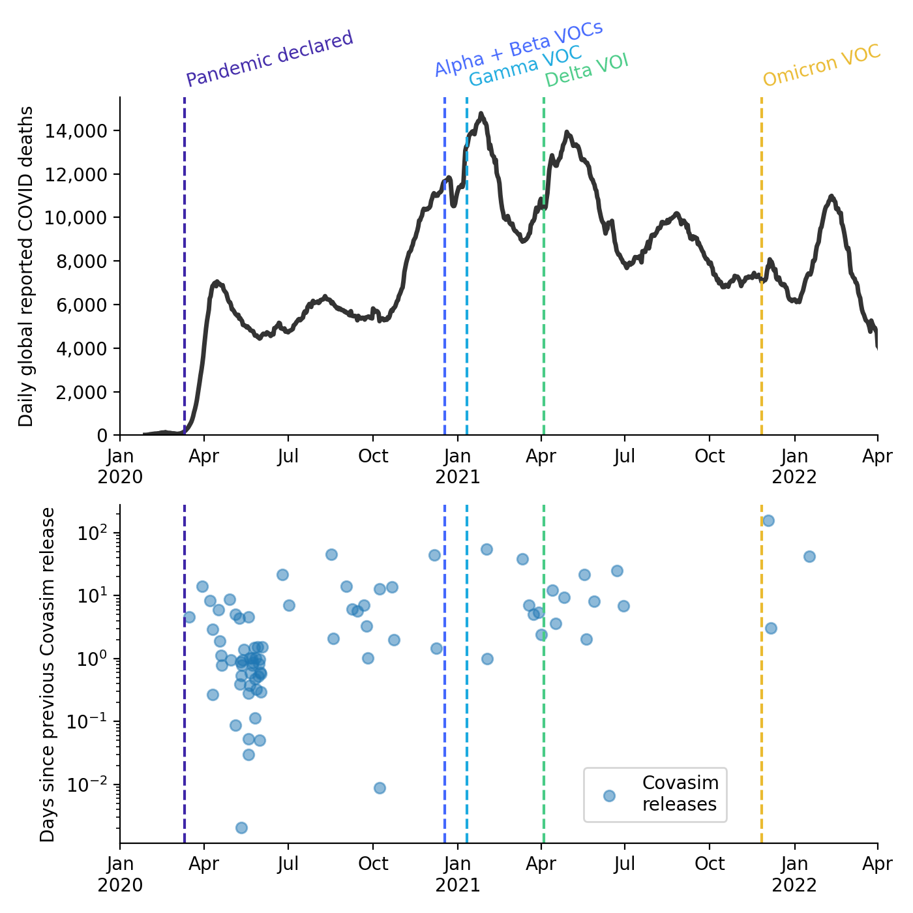
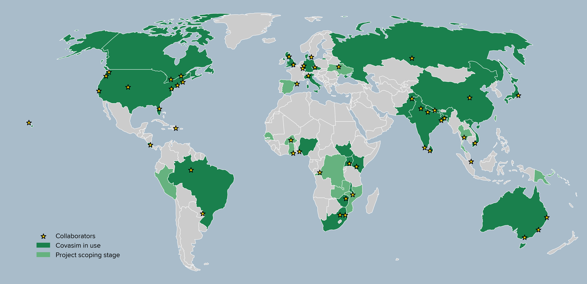

:author: Cliff Kerr 
:email: cliff@covasim.org
:institution: Institute for Disease Modeling, Bill & Melinda Gates Foundation
:institution: School of Physics, University of Sydney

:author: Robyn Stuart 
:email: robyn@math.ku.dk
:institution: Department of Mathematical Sciences, University of Copenhagen
:institution: Burnet Institute

:author: Dina Mistry 
:email: dina.c.mistry@gmail.com
:institution: Twitter

:author: Romesh Abeysuriya 
:email: romesh.abeysuriya@burnet.edu.au
:institution: Burnet Institute

:author: Jamie Cohen 
:email: jamie.cohen@gatesfoundation.org
:institution: Institute for Disease Modeling, Bill & Melinda Gates Foundation

:author: Lauren George 
:email: lauren.george@live.com
:institution: Microsoft

:author: Michał Jastrzębski 
:email: inc007@gmail.com
:institution: GitHub

:author: Michael Famulare 
:email: mike.famulare@gatesfoundation.org
:institution: Institute for Disease Modeling, Bill & Melinda Gates Foundation

:author: Edward Wenger 
:email: edward.wenger@gatesfoundation.org
:institution: Institute for Disease Modeling, Bill & Melinda Gates Foundation

:author: Daniel Klein 
:email: daniel.klein@gatesfoundation.org
:institution: Institute for Disease Modeling, Bill & Melinda Gates Foundation

:bibliography: python_pandemic

-------------------------------------------------------------------------
Python vs. the pandemic: a case study in high-stakes software development
-------------------------------------------------------------------------

.. class:: abstract

   When it became clear in early 2020 that COVID-19 was going to be a major public health threat, politicians and public health officials turned to academic disease modelers like us for urgent guidance. Academic software development is typically a slow and haphazard process, and we realized that business-as-usual would not suffice for dealing with this crisis. Here we describe the case study of how we built Covasim (covasim.org), an agent-based model of COVID-19 epidemiology and public health interventions, by using standard Python libraries like NumPy, Numba, and SciPy along with less common ones like Sciris (sciris.org). Covasim was created in a few weeks, an order of magnitude faster than the typical model development process, and achieves performance comparable to C++ despite being written in pure Python. It has become one of the most widely adopted COVID models, and is used by researchers and policymakers in dozens of countries. Covasim's rapid development was enabled not only by leveraging the Python scientific computing ecosystem, but also by adopting coding practices and workflows that lowered the barriers to entry for scientific contributors without sacrificing either performance or rigor.

.. class:: keywords

   COVID-19, SARS-CoV-2, Epidemiology, Mathematical modeling, NumPy, Numba, Sciris

Background
----------

For decades, scientists have been concerned about the possibility of another global pandemic on the scale of the 1918 flu [REF:pandemic]. Despite a number of "close calls", including outbreaks of SARS in 2002 [REF:sars], Ebola in 2014-2016 [REF:ebola], and flu outbreaks including 1957, 1968, and H1N1 in 2009 [REF:flu] – some of which led to 1 million or more deaths – the world had avoided experiencing a planetary-scale emergent pathogen since the HIV in the 1980s [REF:hiv]. 

In 2015, Bill Gates gave a TED talk stating that the world was not ready to deal with another pandemic [REF:bill]. While the Bill and Melinda Gates Foundation (BMGF) has not historically focused on pandemic preparedness, its expertise in disease surveillance, modeling, and drug discovery made it well placed to contribute to a global pandemic response plan. Founded in 2008, the Institute for Disease Modeling (IDM) has provided analytical support for BMGF and other global health partners, including efforts to eradicate malaria and polio. Since its founding, IDM has built up a portfolio of computational tools to understand, analyze, and predict the dynamics of different diseases.

When "coronavirus disease 2019" (COVID-19) and the virus that causes it (SARS-CoV-2) were first identified in late 2019, our team began summarizing what was known about the virus  [REF:mike-reports]. By early February 2020, even though it was more than a month before the WHO would declare a pandemic [REF:who], it had become clear that COVID-19 was emerging as a major public health threat. The outbreak on the Diamond Princess cruise ship [REF:diamond] was the impetus for us to start modeling COVID in detail. Specifically,  we needed a tool to (a) incorporate new data as soon as it became available, (b) explore policy scenarios, and (c) predict likely future epidemic trajectories.

The first step was to identify which software tool would form the best starting point for our new COVID model. The richest modeling framework used by IDM at the time was EMOD, which is a multi-disease agent-based model written in C++ and based on JSON configuration files [REF:emod]. We also considered Atomica, a multi-disease compartmental model written in Python and based on Excel input files [REF:atomica]. However, both options had significant drawbacks: as a compartmental model, Atomica was unable to capture the individual level detail necessary for modeling the Diamond Princess outbreak (such as passenger-crew interactions); EMOD had sufficient flexibility, but developing new disease modules had historically required months rather than days. 

As a result, we instead started developing Covasim ("COVID-19 Agent-based Simulator") from a nascent agent-based model written in Python, LEMOD-FP ("Light"-EMOD for Family Planning). LEMOD-FP was used to model reproductive health choices of women in Senegal, and this model had in turn been based on an even simpler agent-based model of measles vaccination programs in Nigeria ("Value-of-information simulator" or VoISim). The timeline and interrelations between IDM's software ecosystem are shown in Fig. :ref:`ecosystem`.

.. figure:: fig_ecosystem.png

   IDM's software ecosystem. :label:`ecosystem`

Parallel to the development of Covasim, other research teams at IDM developed their own COVID models, including one based on the EMOD framework [REF:emod], and one based on an earlier influenza model [REF:corvid]. However, while both of these models saw use in academic contexts [REF:emod-rural] [REF:corvid-lancet], neither was able to incorporate new features quickly enough, or was easy enough to use, for widespread adoption in a policy context.

Covasim, by contrast, had immediate real-world impact. The first version was released on 10 March 2020, and on 12 March 2020, its output was presented by Governor Jay Inslee of Washington State as justification for school closures and social distancing measures [REF:inslee]. Since the early days of the pandemic, Covasim releases have coincided with major events in the pandemic, especially the identification of new variants of concern (Fig. :ref:`releases`). Covasim was quickly adopted globally, including applications in the UK regarding school closures [REF:jasmina], Australia regarding outbreak control [REF:robyn], and Vietnam regarding lockdown measures [REF:quang]. 

   Covasim releases since the start of the pandemic. :label:`releases`

To date, Covasim has been downloaded from PyPI over 100,000 times [REF:pypi], used in dozens of academic studies [REF:natcomms], and informed decision-making on every continent (Fig. :ref:`worldmap`). We believe key elements of its success include (a) the simplicity of its architecture, such as using a relatively small number of classes; (b) high performance, enabled by the use of NumPy arrays and Numba decorators; (c) our emphasis on prioritizing usability, including flexible type handling and careful choices of default settings. In the remainder of this paper, we outline these principles in more detail. Our aim is to provide a roadmap for how to quickly develop high-performance scientific computing libraries.

   Covasim releases since the start of the pandemic. :label:`worldmap`

Software architecture and implementation
----------------------------------------

Covasim conceptual design and usage
+++++++++++++++++++++++++++++++++++

Covasim is a standard susceptible-infected-exposed-recovered (SEIR) model (Fig. :ref:`seir`). It is an agent-based model, meaning that individual people and their interactions with one another are simulated. The fundamental calculation that Covasim performs is to calculate the probability that a given person, on a given time step, will change from one state to another, such as from susceptible to infected (i.e., they were infected), from undiagnosed to diagnosed, or from critically ill to dead. Covasim is fully open-source and available on GitHub (http://covasim.org) or PyPI (``pip install covasim``), and comes with comprehensive documentation (http://docs.covasim.org).

   Basic Covasim disease model. The blue arrow shows the process of reinfection. :label:`seir`

The first principle of Covasim's design philosophy is that "Common tasks should be simple" – for example, defining parameters, running a simulation, and plotting results. The following example illustrates this principle: it creates a simulation with a custom parameter value, runs it, and plots the results:

Bibliographies, citations and block quotes
------------------------------------------

If you want to include a ``.bib`` file, do so above by placing  :code:`:bibliography: yourFilenameWithoutExtension` as above (replacing ``mybib``) for a file named :code:`yourFilenameWithoutExtension.bib` after removing the ``.bib`` extension. 

**Do not include any special characters that need to be escaped or any spaces in the bib-file's name**. Doing so makes bibTeX cranky, & the rst to LaTeX+bibTeX transform won't work. 

To reference citations contained in that bibliography use the :code:`:cite:`citation-key`` role, as in :cite:`hume48` (which literally is :code:`:cite:`hume48`` in accordance with the ``hume48`` cite-key in the associated ``mybib.bib`` file).

However, if you use a bibtex file, this will overwrite any manually written references. 

So what would previously have registered as a in text reference ``[Atr03]_`` for 

:: 

     [Atr03] P. Atreides. *How to catch a sandworm*,
           Transactions on Terraforming, 21(3):261-300, August 2003.

what you actually see will be an empty reference rendered as **[?]**.

E.g., [Atr03]_.

If you wish to have a block quote, you can just indent the text, as in 

    When it is asked, What is the nature of all our reasonings concerning matter of fact? the proper answer seems to be, that they are founded on the relation of cause and effect. When again it is asked, What is the foundation of all our reasonings and conclusions concerning that relation? it may be replied in one word, experience. But if we still carry on our sifting humor, and ask, What is the foundation of all conclusions from experience? this implies a new question, which may be of more difficult solution and explication. :cite:`hume48`

Dois in bibliographies
++++++++++++++++++++++

In order to include a doi in your bibliography, add the doi to your bibliography
entry as a string. For example:

.. code-block:: bibtex

   @Book{hume48,
     author =  "David Hume",
     year =    "1748",
     title =   "An enquiry concerning human understanding",
     address =     "Indianapolis, IN",
     publisher =   "Hackett",
     doi = "10.1017/CBO9780511808432",
   }

If there are errors when adding it due to non-alphanumeric characters, see if
wrapping the doi in ``\detokenize`` works to solve the issue.

.. code-block:: bibtex

   @Book{hume48,
     author =  "David Hume",
     year =    "1748",
     title =   "An enquiry concerning human understanding",
     address =     "Indianapolis, IN",
     publisher =   "Hackett",
     doi = \detokenize{10.1017/CBO9780511808432},
   }

Source code examples
--------------------

Of course, no paper would be complete without some source code.  Without
highlighting, it would look like this::

   def sum(a, b):
       """Sum two numbers."""

       return a + b

With code-highlighting:

.. code-block:: python

   def sum(a, b):
       """Sum two numbers."""

       return a + b

Maybe also in another language, and with line numbers:

.. code-block:: c
   :linenos:

   int main() {
       for (int i = 0; i < 10; i++) {
           /* do something */
       }
       return 0;
   }

Or a snippet from the above code, starting at the correct line number:

.. code-block:: c
   :linenos:
   :linenostart: 2

   for (int i = 0; i < 10; i++) {
       /* do something */
   }
 
Important Part
--------------

It is well known [Atr03]_ that Spice grows on the planet Dune.  Test
some maths, for example :math:`e^{\pi i} + 3 \delta`.  Or maybe an
equation on a separate line:

.. math::

   g(x) = \int_0^\infty f(x) dx

or on multiple, aligned lines:

.. math::
   :type: eqnarray

   g(x) &=& \int_0^\infty f(x) dx \\
        &=& \ldots

The area of a circle and volume of a sphere are given as

.. math::
   :label: circarea

   A(r) = \pi r^2.

.. math::
   :label: spherevol

   V(r) = \frac{4}{3} \pi r^3

We can then refer back to Equation (:ref:`circarea`) or
(:ref:`spherevol`) later.

Mauris purus enim, volutpat non dapibus et, gravida sit amet sapien. In at
consectetur lacus. Praesent orci nulla, blandit eu egestas nec, facilisis vel
lacus. Fusce non ante vitae justo faucibus facilisis. Nam venenatis lacinia
turpis. Donec eu ultrices mauris. Ut pulvinar viverra rhoncus. Vivamus
adipiscing faucibus ligula, in porta orci vehicula in. Suspendisse quis augue
arcu, sit amet accumsan diam. Vestibulum lacinia luctus dui. Aliquam odio arcu,
faucibus non laoreet ac, condimentum eu quam. Quisque et nunc non diam
consequat iaculis ut quis leo. Integer suscipit accumsan ligula. Sed nec eros a
orci aliquam dictum sed ac felis. Suspendisse sit amet dui ut ligula iaculis
sollicitudin vel id velit. Pellentesque hendrerit sapien ac ante facilisis
lacinia. Nunc sit amet sem sem. In tellus metus, elementum vitae tincidunt ac,
volutpat sit amet mauris. Maecenas [#]_ diam turpis, placerat [#]_ at adipiscing ac,
pulvinar id metus.

.. [#] On the one hand, a footnote.
.. [#] On the other hand, another footnote.

.. figure:: fig_ecosystem.png

   This is the caption. :label:`egfig`

.. figure:: fig_ecosystem.png
   :align: center
   :figclass: w

   This is a wide figure, specified by adding "w" to the figclass.  It is also
   center aligned, by setting the align keyword (can be left, right or center).

.. figure:: fig_ecosystem.png
   :scale: 20%
   :figclass: bht

   This is the caption on a smaller figure that will be placed by default at the
   bottom of the page, and failing that it will be placed inline or at the top.
   Note that for now, scale is relative to a completely arbitrary original
   reference size which might be the original size of your image - you probably
   have to play with it. :label:`egfig2`

As you can see in Figures :ref:`egfig` and :ref:`egfig2`, this is how you reference auto-numbered
figures.

.. table:: This is the caption for the materials table. :label:`mtable`

   +------------+----------------+
   | Material   | Units          |
   +============+================+
   | Stone      | 3              |
   +------------+----------------+
   | Water      | 12             |
   +------------+----------------+
   | Cement     | :math:`\alpha` |
   +------------+----------------+

We show the different quantities of materials required in Table
:ref:`mtable`.

.. The statement below shows how to adjust the width of a table.

.. raw:: latex

   \setlength{\tablewidth}{0.8\linewidth}

.. table:: This is the caption for the wide table.
   :class: w

   +--------+----+------+------+------+------+--------+
   | This   | is |  a   | very | very | wide | table  |
   +--------+----+------+------+------+------+--------+

Unfortunately, restructuredtext can be picky about tables, so if it simply
won't work try raw LaTeX:

.. raw:: latex

   \begin{table*}

     \begin{longtable*}{|l|r|r|r|}
     \hline
     \multirow{2}{*}{Projection} & \multicolumn{3}{c|}{Area in square miles}\tabularnewline
     \cline{2-4}
      & Large Horizontal Area & Large Vertical Area & Smaller Square Area\tabularnewline
     \hline
     Albers Equal Area  & 7,498.7 & 10,847.3 & 35.8\tabularnewline
     \hline
     Web Mercator & 13,410.0 & 18,271.4 & 63.0\tabularnewline
     \hline
     Difference & 5,911.3 & 7,424.1 & 27.2\tabularnewline
     \hline
     Percent Difference & 44\% & 41\% & 43\%\tabularnewline
     \hline
     \end{longtable*}

     \caption{Area Comparisons \DUrole{label}{quanitities-table}}

   \end{table*}

Perhaps we want to end off with a quote by Lao Tse [#]_:

  *Muddy water, let stand, becomes clear.*

.. [#] :math:`\mathrm{e^{-i\pi}}`

.. Customised LaTeX packages
.. -------------------------

.. Please avoid using this feature, unless agreed upon with the
.. proceedings editors.

.. ::

..   .. latex::
..      :usepackage: somepackage

..      Some custom LaTeX source here.

References
----------
.. [Atr03] P. Atreides. *How to catch a sandworm*,
           Transactions on Terraforming, 21(3):261-300, August 2003.

